### Hello World! 😄

<h1 align="center"> I am Mónica Gómez-Vadillo </h1>
<h3 align="center">PhD Student (Biogeography & Macroecology) | Data Scientist </h3>

- 👋 I' am Mónica Gómez-Vadillo
- 🔭 I’m currently working on my doctoral thesis in the Department of Biogeography and Global Change of the Museo Nacional de Ciencias Naturales (CSIC).
- 😄 In the past I have worked as a data scientist in the energy sector for two years.
- 🌱I have studied Biology at the URJC and the Master in Ecology at the UAM. I have also studied the Master Data Science and Business Analytics at IMF Smart Education, indra and UCAV.

 
<h3 align="center" > Connect with me 🤝 </h3>

    
    
    
    
    
    
    	
    

<h3 align="center">
  
  Git Activity
</h3>

  <picture>
    <source media="(prefers-color-scheme: dark)"
            srcset="./profile/overview.dark.svg">
    <source media="(prefers-color-scheme: light)"
            srcset="./profile/overview.light.svg">
    
  </picture>

  <picture>
    <source media="(prefers-color-scheme: dark)"
            srcset="./profile/contributions.dark.svg">
    <source media="(prefers-color-scheme: light)"
            srcset="./profile/contributions.light.svg">
    
  </picture>

  <picture>
    <source media="(prefers-color-scheme: dark)"
            srcset="./profile/languages.dark.svg">
    <source media="(prefers-color-scheme: light)"
            srcset="./profile/languages.light.svg">
    
  </picture>

